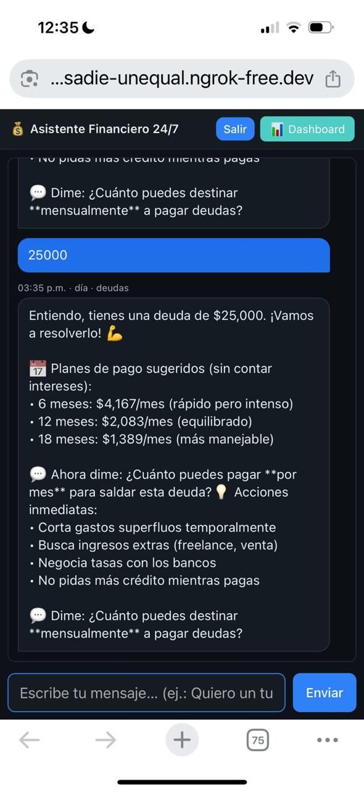
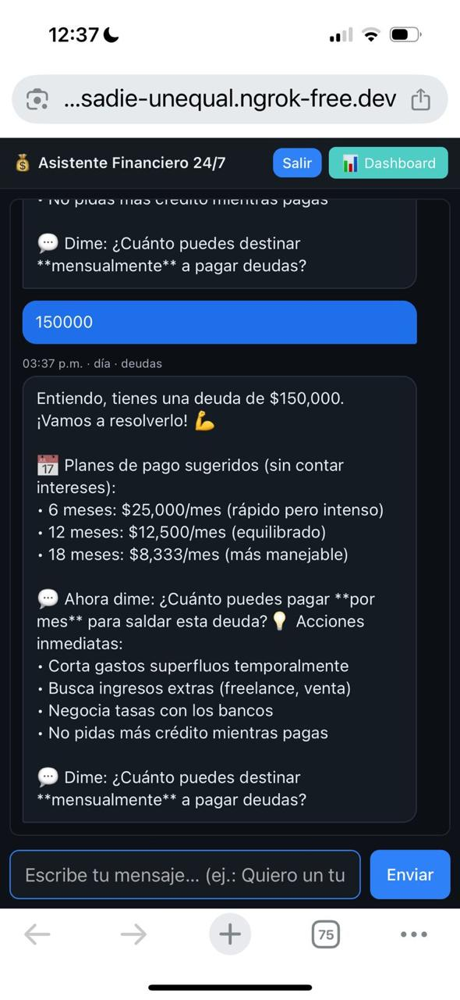
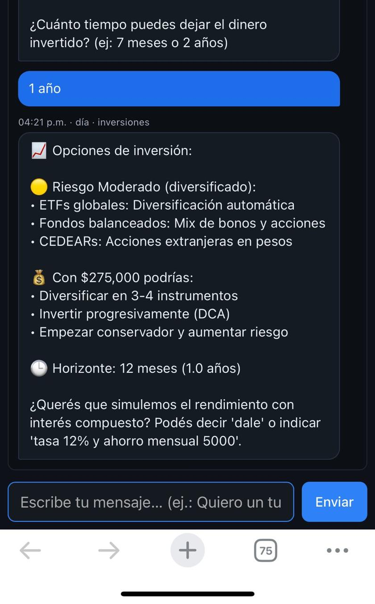

# 💰 Finance Assistant Bot

[](https://www.python.org/)
[](https://flask.palletsprojects.com/)
[](https://www.twilio.com/)
[](https://www.docker.com/)
[](https://www.sqlite.org/)
[](LICENSE)

Personal-finance education and calculation application with structured conversational flows.

The project combines Python, Flask, SQLite, SQLAlchemy, APIs, Docker, and optional Twilio integration into a containerised personal-finance education and calculation application.

## Key Features

- Structured conversational flows for budgeting, debt, investment, and education topics.
- Budgeting and expense guidance for monthly income, spending, and savings targets.
- Debt repayment guidance with Snowball and custom plans.
- Investment comparisons based on amount, time horizon, and risk profile.
- Financial calculators for compound interest, loan payments, time-to-goal, and comparisons.
- Plain-language educational responses about common financial concepts.

## Screenshots







## How It Works

Core components:

- NLP engine: interprets user messages and extracts financial intent.
- Scenario logic: selects the relevant module for debt, budgeting, investments, or calculators.
- Dynamic response generator: combines rules, templates, and numerical calculations.
- Validation layer: blocks unrealistic values and keeps outputs consistent.

Modules:

- Budget module
- Debt repayment module
- Investment advisor module
- Financial calculator module
- Education module

## HTTP Endpoints

- `/` serves the chat interface.
- `/health` provides a simple health check.
- `/api/user` returns the current profile state.
- `/api/login` creates or updates the user session.
- `/api/logout` clears the session cookie.
- `/api/chat` processes chat messages.
- `/dashboard` opens the chart dashboard.
- `/whatsapp-webhook` handles optional Twilio messages.

## Project Structure

```text
finance-assistant-bot/
├── img/                         # Screenshots for documentation
├── src/
│   ├── intents/                 # Intent detection logic
│   ├── modules/                 # Debt, investments, calculator, etc.
│   └── utils/                   # Helpers
├── templates/
├── web_app.py                   # Flask application entry point
├── chatbot_core.py
├── calculators.py
├── database.py
├── visualizations.py
├── tests/
├── requirements.txt
└── README.md
```

## Setup

1. Install dependencies:

```bash
pip install -r requirements.txt
```

2. Run the Flask web interface locally:

```bash
flask --app web_app run --debug
```

3. Optional: run with Docker:

```bash
docker compose up --build
```

4. Optional: connect Twilio for WhatsApp support after configuring credentials locally.

## Tests

Run the existing test suite:

```bash
pytest -q
```

## Why This Project Matters

This project demonstrates:

- Rule-based and numerical reasoning.
- Data-processing for debt, investment, and interest calculations.
- User-friendly conversational flows.
- Practical financial domain knowledge.
- UI thinking through the chat and dashboard views.

## Limitations

- Two local tests depend on `192.168.1.42:5000` and currently require that environment to be available.

## Author

Ramiro Ottone Villar

[](https://github.com/rAmIro-89)
[](https://www.linkedin.com/in/ramiro-ottone-villar)
